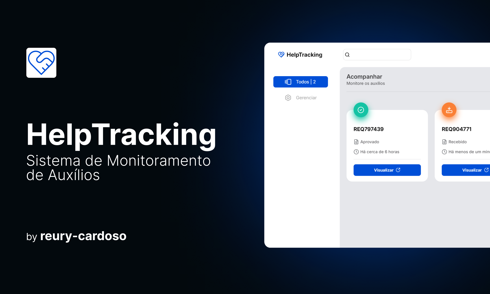

md
# HelpTracking - Sistema de Monitoramento de Auxílios

O **HelpTracking** é um sistema desenvolvido para facilitar o monitoramento de auxílios, como assistência educacional e de saúde. O sistema foi criado como parte do Módulo 05 do programa **Programadores do Amanhã**.

<p align="center">
  
</p>

## 🖥 Deploy

Você pode acessar a aplicação em funcionamento através deste link:  
**[HelpTracking - Deploy](https://react-tracking-api.vercel.app/)**

## 🚀 Tecnologias Utilizadas

- **React.js**: Framework para o desenvolvimento do frontend.
- **Node.js**: Utilizado no backend para o gerenciamento da API.
- **Express.js**: Framework para criação da API REST.
- **Leaflet.js**: Integração com mapas interativos.
- **Vercel**: Deploy da aplicação frontend.
- **GitHub**: Repositório e versionamento do código.

## ⚙️ Funcionalidades

- **Adicionar Auxílio**: Criação de novas solicitações de auxílio no sistema.
- **Buscar Auxílio**: Exibir todas as solicitações registradas, com filtros por status.
- **Editar Auxílio**: Modificar as informações de uma solicitação existente.
- **Deletar Auxílio**: Remover uma solicitação do sistema.
- **Gerenciar Status**: Atualizar o status do auxílio (Recebido, Em Análise, Entregue).

## 🔧 Instalação Local

Siga as instruções abaixo para rodar o projeto localmente:

### 1. Clonar o repositório

Clone o repositório do backend para sua máquina:

```bash
git clone https://github.com/reury-cardoso/react-tracking-api-BACKEND
```

### 2. Instalar dependências

Acesse a pasta do backend e instale as dependências necessárias:

```bash
cd react-tracking-api-BACKEND
npm install
```

### 3. Rodar a API

Inicie a API localmente na porta `3000`:

```bash
npm start
```

A API será executada em `http://localhost:3000`.

### 4. Configurar o Frontend

Clone o repositório do frontend e configure as variáveis de ambiente:

```bash
git clone https://github.com/reury-cardoso/react-tracking-api
cd react-tracking-api
```

Crie um arquivo `.env` na raiz do projeto com a seguinte configuração:

```
VITE_API_URL=http://localhost:3000
```

### 5. Rodar o Frontend

Instale as dependências e inicie o servidor de desenvolvimento:

```bash
npm install
npm run dev
```

O frontend estará disponível na URL local informada pelo terminal.

## Endpoints da API

A API oferece os seguintes endpoints para gerenciar auxílios:

- `GET /`: Buscar todas as solicitações de auxílio.
- `GET /:trackingCode`: Buscar um auxílio específico pelo código de rastreamento.
- `GET /all/counter`: Obter o número total de auxílios registrados.
- `POST /`: Criar uma nova solicitação de auxílio.
- `PUT /:id`: Atualizar uma solicitação de auxílio existente pelo ID.
- `DELETE /:id`: Deletar uma solicitação de auxílio existente pelo ID.

## 📝 License

Este projeto é licenciado sob a licença MIT. Veja o arquivo [LICENSE](LICENSE) para mais informações.

---
